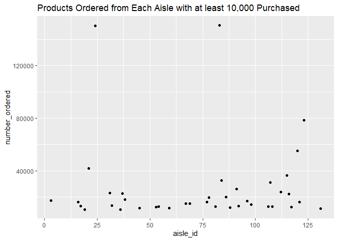

p8105\_hw3\_yo2336
================
Yoo Rim Oh

# Problem 1

## Load instacart data and description

Use data() to load data from p8105.datasets

``` r
data("instacart")

nrow(instacart)
```

    ## [1] 1384617

``` r
ncol(instacart)
```

    ## [1] 15

``` r
names(instacart)
```

    ##  [1] "order_id"               "product_id"             "add_to_cart_order"     
    ##  [4] "reordered"              "user_id"                "eval_set"              
    ##  [7] "order_number"           "order_dow"              "order_hour_of_day"     
    ## [10] "days_since_prior_order" "product_name"           "aisle_id"              
    ## [13] "department_id"          "aisle"                  "department"

The instacart data has 15 variables representing product names,
departments and aisles each product is from, and details on the orders.
It also has 1,384,617 total observations for each products ordered.

## Total aisle and description

``` r
range(pull(instacart, aisle_id))
```

    ## [1]   1 134

``` r
count(instacart, aisle_id, aisle) %>%
  arrange(desc(n))
```

    ## # A tibble: 134 x 3
    ##    aisle_id aisle                              n
    ##       <int> <chr>                          <int>
    ##  1       83 fresh vegetables              150609
    ##  2       24 fresh fruits                  150473
    ##  3      123 packaged vegetables fruits     78493
    ##  4      120 yogurt                         55240
    ##  5       21 packaged cheese                41699
    ##  6      115 water seltzer sparkling water  36617
    ##  7       84 milk                           32644
    ##  8      107 chips pretzels                 31269
    ##  9       91 soy lactosefree                26240
    ## 10      112 bread                          23635
    ## # ... with 124 more rows

There are 134 aisles total and top three aisles where the most products
ordered came from were fresh vegetables, fresh fruits, and packaged
vegetables fruits in order.

## Aisle vs product plot

Filtered to only have aisle data with more than 10,000 products ordered.
Then created a plot for how many products have been ordered from each
aisle.

``` r
aisle_df =
  instacart %>%
  count(aisle_id, name = "number_ordered") %>%
  filter(number_ordered > 10000)
  
aisle_df %>%  
  ggplot(aes(x = aisle_id, y = number_ordered)) +
  geom_point() +
  labs(title = "Products Ordered from Each Aisle with at least 10,000 Purchased") +
  scale_x_continuous(
    breaks = c(0, 25, 50, 75, 100, 125))
```

<!-- -->

There were two aisles with significantly higher purchased products with
approximately over 140,000 counts. However, generally most aisles had
under 40,000 purchased products.

## Popular items per aisle

Created data frame for each aisle, baking ingredient, dog food care, and
packaged vegetables fruits. Filtered to aisle specific data and counted
how many times each products were ordered. Arranged data in descending
order to get top 3 popularly ordered products. Then joined all three
data frames and created a table representing the data.

``` r
bake_ingr_df =
  instacart %>%
  select(product_name, aisle) %>%
  filter(aisle == "baking ingredients") %>%
  count(aisle, product_name, name = "count_baking") %>%
  arrange(desc(count_baking)) %>%
  head(3) %>%
  mutate(rank = c(1, 2, 3)) %>%
  pivot_wider(
    names_from = "aisle",
    values_from = "product_name"
  ) %>%
  relocate(rank, "baking ingredients")

dog_food_care_df = 
  instacart %>%
  select(product_name, aisle) %>%
  filter(aisle == "dog food care") %>%
  count(aisle, product_name, name = "count_dog") %>%
  arrange(desc(count_dog)) %>%
  head(3) %>%
  mutate(rank = c(1, 2, 3)) %>%
  pivot_wider(
    names_from = "aisle",
    values_from = "product_name"
  ) %>%
  relocate(rank, "dog food care")

pack_veg_fruit_df = 
  instacart %>%
  select(product_name, aisle) %>%
  filter(aisle == "packaged vegetables fruits") %>%
  count(aisle, product_name, name = "count_packaged") %>%
  arrange(desc(count_packaged)) %>%
  head(3) %>%
  mutate(rank = c(1, 2, 3)) %>%
  pivot_wider(
    names_from = "aisle",
    values_from = "product_name"
  ) %>%
  relocate(rank, "packaged vegetables fruits")

popular_table_df = 
  left_join(bake_ingr_df, left_join(dog_food_care_df, pack_veg_fruit_df, by = "rank"), 
            by = "rank") %>%
  janitor::clean_names()

knitr::kable(popular_table_df, caption = "Top 3 Products Ordered from Selected Aisles")
```

| rank | baking\_ingredients | count\_baking | dog\_food\_care                               | count\_dog | packaged\_vegetables\_fruits | count\_packaged |
|-----:|:--------------------|--------------:|:----------------------------------------------|-----------:|:-----------------------------|----------------:|
|    1 | Light Brown Sugar   |           499 | Snack Sticks Chicken & Rice Recipe Dog Treats |         30 | Organic Baby Spinach         |            9784 |
|    2 | Pure Baking Soda    |           387 | Organix Chicken & Brown Rice Recipe           |         28 | Organic Raspberries          |            5546 |
|    3 | Cane Sugar          |           336 | Small Dog Biscuits                            |         26 | Organic Blueberries          |            4966 |

Top 3 Products Ordered from Selected Aisles

The top three products purchased from the baking ingredients were light
brown sugar, pure baking soda, and cane sugar. The top three products
purchased from the dog food care aisle were snack sticks chicken & rice
recipe dog treats, organix chicken & brown rice recipe, and small dog
biscuits. Finally the top three most purchased products from the
packaged vegetables fruits were organic baby spinach, organic
raspberries, and organic blueberries. The counts for the top three
products purchased from the packaged vegetables fruits aisle were
significantly higher as compared to the other two aisles.

## Mean hour a product was ordered each day

Filtered data for each product, pink lady apple and coffee ice cream.
Grouped filtered data based on day of the week (0 to 6, what specific
day each number represents not specified) and created new variable for
mean hour each product was ordered. Then created a table for each pink
lady apple and coffee ice cream to represent the data.

``` r
pink_lady_apple =
  instacart %>%
  select("day" = "order_dow", order_hour_of_day, product_name) %>%
  filter(product_name == "Pink Lady Apples") %>%
  group_by(day) %>%
  summarize(mean_order_hour = mean(order_hour_of_day))
knitr::kable(pink_lady_apple, caption = "Mean Hour of Day Pink Lady Apples are Ordered")
```

| day | mean\_order\_hour |
|----:|------------------:|
|   0 |          13.44118 |
|   1 |          11.36000 |
|   2 |          11.70213 |
|   3 |          14.25000 |
|   4 |          11.55172 |
|   5 |          12.78431 |
|   6 |          11.93750 |

Mean Hour of Day Pink Lady Apples are Ordered

``` r
coffee_ice_cream =
  instacart %>%
  select("day" = "order_dow", order_hour_of_day, product_name) %>%
  filter(product_name == "Coffee Ice Cream") %>%
  group_by(day) %>%
  summarize(mean_order_hour = mean(order_hour_of_day))
knitr::kable(coffee_ice_cream, caption = "Mean Hour of Day Coffee Ice Creams are Ordered")
```

| day | mean\_order\_hour |
|----:|------------------:|
|   0 |          13.77419 |
|   1 |          14.31579 |
|   2 |          15.38095 |
|   3 |          15.31818 |
|   4 |          15.21739 |
|   5 |          12.26316 |
|   6 |          13.83333 |

Mean Hour of Day Coffee Ice Creams are Ordered

The mean hour of the day coffee ice creams were ordered were generally
later than the pink lady apple purchases.

# Problem 2

## Load BRFSS data

``` r
data(brfss_smart2010)
```

## Clean BRFSS

Filtered data to only see overall health topics. Reassigned the 5
responses that goes from poor to excellent to be an ordered factors.

``` r
overall_health =
  brfss_smart2010 %>%
  janitor::clean_names() %>%
  filter(topic == "Overall Health") %>%
  mutate(response = factor(response, levels = c("Poor", "Fair", "Good", "Very good", "Excellent"),
                           ordered = TRUE)) %>%
  rename("state" = "locationabbr", "county" = "locationdesc")
```

## States with &gt;= 7 observed locations in 2002 and 2010

Filtered data to year specific, 2002 and 2010 each. Counted how many
observations each state had but divided results by 5 since observations
from each county were divided based on the 5 responses. Then filtered
data to only see states with at least 7 locations.

``` r
nrow(
overall_health %>%
  filter(year == 2002) %>%
  count(state) %>%
  mutate(n = n/5) %>%
  filter(n >= 7))
```

    ## [1] 6

``` r
nrow(
  overall_health %>%
  filter(year == 2010) %>%
  count(state) %>%
  mutate(n = n/5) %>%
  filter(n >= 7))
```

    ## [1] 14

In 2002, 6 states observed 7 or more locations. In 2010, 14 states
observed 7 or more locations.

## Excellent response data frame and plot

Filtered data to only show observations with response excellent. Added
new variable to represent mean data value across different locations
within the states. Then created a plot to observe to pattern for each
state.

``` r
excellent_df =
  overall_health %>%
  filter(response == "Excellent") %>%
  select(year, state, data_value) %>%
  group_by(year, state) %>%
  summarize(mean_data_value = mean(data_value)) %>%
  drop_na(mean_data_value)
```

    ## `summarise()` has grouped output by 'year'. You can override using the `.groups` argument.

``` r
excellent_df %>%
  ggplot(aes(x = year, y = mean_data_value, color = state)) +
  geom_point() +
  geom_line() +
  labs(title = "Mean Excellent Responses Across Different Locations Within Each State")
```

<!-- -->

The mean values from 2002 to 2010 generally decreased very slightly over
time for each states. With some exceptions, the mean values range from
15 to 30 approximately.

## Plot for NY responses to overall health in 2006 and 2010

Filtered to see data for New York state only and for years 2006 and
2010. Then created a plot showing the distribution of the responses per
year.

``` r
overall_health %>%
  filter(state == "NY", year == c(2006, 2010)) %>%
  select(year, state, response, data_value) %>%
  ggplot(aes(x = response, y = data_value)) +
  geom_boxplot() +
  facet_grid(. ~ year) +
  labs(title = "Distribution of Responses to Overall Health in NY")
```

    ## Warning in year == c(2006, 2010): longer object length is not a multiple of
    ## shorter object length

<!-- -->

Generally, there were more observations for the responses good and very
good during the year 2010 compared to 2006.There were less lower level
responses, poor and fair, observed as compared to higher responses for
both years.

# Problem 3

## Load and clean data

Loaded csv data and cleaned. Added new variable to assign whether it was
a weekday or weekend.

``` r
accel_df = 
  read_csv("accel_data.csv") %>%
  janitor::clean_names() %>%
  mutate(week_type = case_when(
    day %in% c("Monday", "Tuesday", "Wednesday", "Thursday", "Friday") ~ "weekday",
    day %in% c("Saturday", "Sunday") ~ "weekend")) %>%
  relocate(week, day_id, day, week_type)
```

    ## Rows: 35 Columns: 1443

    ## -- Column specification --------------------------------------------------------
    ## Delimiter: ","
    ## chr    (1): day
    ## dbl (1442): week, day_id, activity.1, activity.2, activity.3, activity.4, ac...

    ## 
    ## i Use `spec()` to retrieve the full column specification for this data.
    ## i Specify the column types or set `show_col_types = FALSE` to quiet this message.

``` r
nrow(accel_df)
```

    ## [1] 35

``` r
ncol(accel_df)
```

    ## [1] 1444

``` r
names(accel_df)
```

    ##    [1] "week"          "day_id"        "day"           "week_type"    
    ##    [5] "activity_1"    "activity_2"    "activity_3"    "activity_4"   
    ##    [9] "activity_5"    "activity_6"    "activity_7"    "activity_8"   
    ##   [13] "activity_9"    "activity_10"   "activity_11"   "activity_12"  
    ##   [17] "activity_13"   "activity_14"   "activity_15"   "activity_16"  
    ##   [21] "activity_17"   "activity_18"   "activity_19"   "activity_20"  
    ##   [25] "activity_21"   "activity_22"   "activity_23"   "activity_24"  
    ##   [29] "activity_25"   "activity_26"   "activity_27"   "activity_28"  
    ##   [33] "activity_29"   "activity_30"   "activity_31"   "activity_32"  
    ##   [37] "activity_33"   "activity_34"   "activity_35"   "activity_36"  
    ##   [41] "activity_37"   "activity_38"   "activity_39"   "activity_40"  
    ##   [45] "activity_41"   "activity_42"   "activity_43"   "activity_44"  
    ##   [49] "activity_45"   "activity_46"   "activity_47"   "activity_48"  
    ##   [53] "activity_49"   "activity_50"   "activity_51"   "activity_52"  
    ##   [57] "activity_53"   "activity_54"   "activity_55"   "activity_56"  
    ##   [61] "activity_57"   "activity_58"   "activity_59"   "activity_60"  
    ##   [65] "activity_61"   "activity_62"   "activity_63"   "activity_64"  
    ##   [69] "activity_65"   "activity_66"   "activity_67"   "activity_68"  
    ##   [73] "activity_69"   "activity_70"   "activity_71"   "activity_72"  
    ##   [77] "activity_73"   "activity_74"   "activity_75"   "activity_76"  
    ##   [81] "activity_77"   "activity_78"   "activity_79"   "activity_80"  
    ##   [85] "activity_81"   "activity_82"   "activity_83"   "activity_84"  
    ##   [89] "activity_85"   "activity_86"   "activity_87"   "activity_88"  
    ##   [93] "activity_89"   "activity_90"   "activity_91"   "activity_92"  
    ##   [97] "activity_93"   "activity_94"   "activity_95"   "activity_96"  
    ##  [101] "activity_97"   "activity_98"   "activity_99"   "activity_100" 
    ##  [105] "activity_101"  "activity_102"  "activity_103"  "activity_104" 
    ##  [109] "activity_105"  "activity_106"  "activity_107"  "activity_108" 
    ##  [113] "activity_109"  "activity_110"  "activity_111"  "activity_112" 
    ##  [117] "activity_113"  "activity_114"  "activity_115"  "activity_116" 
    ##  [121] "activity_117"  "activity_118"  "activity_119"  "activity_120" 
    ##  [125] "activity_121"  "activity_122"  "activity_123"  "activity_124" 
    ##  [129] "activity_125"  "activity_126"  "activity_127"  "activity_128" 
    ##  [133] "activity_129"  "activity_130"  "activity_131"  "activity_132" 
    ##  [137] "activity_133"  "activity_134"  "activity_135"  "activity_136" 
    ##  [141] "activity_137"  "activity_138"  "activity_139"  "activity_140" 
    ##  [145] "activity_141"  "activity_142"  "activity_143"  "activity_144" 
    ##  [149] "activity_145"  "activity_146"  "activity_147"  "activity_148" 
    ##  [153] "activity_149"  "activity_150"  "activity_151"  "activity_152" 
    ##  [157] "activity_153"  "activity_154"  "activity_155"  "activity_156" 
    ##  [161] "activity_157"  "activity_158"  "activity_159"  "activity_160" 
    ##  [165] "activity_161"  "activity_162"  "activity_163"  "activity_164" 
    ##  [169] "activity_165"  "activity_166"  "activity_167"  "activity_168" 
    ##  [173] "activity_169"  "activity_170"  "activity_171"  "activity_172" 
    ##  [177] "activity_173"  "activity_174"  "activity_175"  "activity_176" 
    ##  [181] "activity_177"  "activity_178"  "activity_179"  "activity_180" 
    ##  [185] "activity_181"  "activity_182"  "activity_183"  "activity_184" 
    ##  [189] "activity_185"  "activity_186"  "activity_187"  "activity_188" 
    ##  [193] "activity_189"  "activity_190"  "activity_191"  "activity_192" 
    ##  [197] "activity_193"  "activity_194"  "activity_195"  "activity_196" 
    ##  [201] "activity_197"  "activity_198"  "activity_199"  "activity_200" 
    ##  [205] "activity_201"  "activity_202"  "activity_203"  "activity_204" 
    ##  [209] "activity_205"  "activity_206"  "activity_207"  "activity_208" 
    ##  [213] "activity_209"  "activity_210"  "activity_211"  "activity_212" 
    ##  [217] "activity_213"  "activity_214"  "activity_215"  "activity_216" 
    ##  [221] "activity_217"  "activity_218"  "activity_219"  "activity_220" 
    ##  [225] "activity_221"  "activity_222"  "activity_223"  "activity_224" 
    ##  [229] "activity_225"  "activity_226"  "activity_227"  "activity_228" 
    ##  [233] "activity_229"  "activity_230"  "activity_231"  "activity_232" 
    ##  [237] "activity_233"  "activity_234"  "activity_235"  "activity_236" 
    ##  [241] "activity_237"  "activity_238"  "activity_239"  "activity_240" 
    ##  [245] "activity_241"  "activity_242"  "activity_243"  "activity_244" 
    ##  [249] "activity_245"  "activity_246"  "activity_247"  "activity_248" 
    ##  [253] "activity_249"  "activity_250"  "activity_251"  "activity_252" 
    ##  [257] "activity_253"  "activity_254"  "activity_255"  "activity_256" 
    ##  [261] "activity_257"  "activity_258"  "activity_259"  "activity_260" 
    ##  [265] "activity_261"  "activity_262"  "activity_263"  "activity_264" 
    ##  [269] "activity_265"  "activity_266"  "activity_267"  "activity_268" 
    ##  [273] "activity_269"  "activity_270"  "activity_271"  "activity_272" 
    ##  [277] "activity_273"  "activity_274"  "activity_275"  "activity_276" 
    ##  [281] "activity_277"  "activity_278"  "activity_279"  "activity_280" 
    ##  [285] "activity_281"  "activity_282"  "activity_283"  "activity_284" 
    ##  [289] "activity_285"  "activity_286"  "activity_287"  "activity_288" 
    ##  [293] "activity_289"  "activity_290"  "activity_291"  "activity_292" 
    ##  [297] "activity_293"  "activity_294"  "activity_295"  "activity_296" 
    ##  [301] "activity_297"  "activity_298"  "activity_299"  "activity_300" 
    ##  [305] "activity_301"  "activity_302"  "activity_303"  "activity_304" 
    ##  [309] "activity_305"  "activity_306"  "activity_307"  "activity_308" 
    ##  [313] "activity_309"  "activity_310"  "activity_311"  "activity_312" 
    ##  [317] "activity_313"  "activity_314"  "activity_315"  "activity_316" 
    ##  [321] "activity_317"  "activity_318"  "activity_319"  "activity_320" 
    ##  [325] "activity_321"  "activity_322"  "activity_323"  "activity_324" 
    ##  [329] "activity_325"  "activity_326"  "activity_327"  "activity_328" 
    ##  [333] "activity_329"  "activity_330"  "activity_331"  "activity_332" 
    ##  [337] "activity_333"  "activity_334"  "activity_335"  "activity_336" 
    ##  [341] "activity_337"  "activity_338"  "activity_339"  "activity_340" 
    ##  [345] "activity_341"  "activity_342"  "activity_343"  "activity_344" 
    ##  [349] "activity_345"  "activity_346"  "activity_347"  "activity_348" 
    ##  [353] "activity_349"  "activity_350"  "activity_351"  "activity_352" 
    ##  [357] "activity_353"  "activity_354"  "activity_355"  "activity_356" 
    ##  [361] "activity_357"  "activity_358"  "activity_359"  "activity_360" 
    ##  [365] "activity_361"  "activity_362"  "activity_363"  "activity_364" 
    ##  [369] "activity_365"  "activity_366"  "activity_367"  "activity_368" 
    ##  [373] "activity_369"  "activity_370"  "activity_371"  "activity_372" 
    ##  [377] "activity_373"  "activity_374"  "activity_375"  "activity_376" 
    ##  [381] "activity_377"  "activity_378"  "activity_379"  "activity_380" 
    ##  [385] "activity_381"  "activity_382"  "activity_383"  "activity_384" 
    ##  [389] "activity_385"  "activity_386"  "activity_387"  "activity_388" 
    ##  [393] "activity_389"  "activity_390"  "activity_391"  "activity_392" 
    ##  [397] "activity_393"  "activity_394"  "activity_395"  "activity_396" 
    ##  [401] "activity_397"  "activity_398"  "activity_399"  "activity_400" 
    ##  [405] "activity_401"  "activity_402"  "activity_403"  "activity_404" 
    ##  [409] "activity_405"  "activity_406"  "activity_407"  "activity_408" 
    ##  [413] "activity_409"  "activity_410"  "activity_411"  "activity_412" 
    ##  [417] "activity_413"  "activity_414"  "activity_415"  "activity_416" 
    ##  [421] "activity_417"  "activity_418"  "activity_419"  "activity_420" 
    ##  [425] "activity_421"  "activity_422"  "activity_423"  "activity_424" 
    ##  [429] "activity_425"  "activity_426"  "activity_427"  "activity_428" 
    ##  [433] "activity_429"  "activity_430"  "activity_431"  "activity_432" 
    ##  [437] "activity_433"  "activity_434"  "activity_435"  "activity_436" 
    ##  [441] "activity_437"  "activity_438"  "activity_439"  "activity_440" 
    ##  [445] "activity_441"  "activity_442"  "activity_443"  "activity_444" 
    ##  [449] "activity_445"  "activity_446"  "activity_447"  "activity_448" 
    ##  [453] "activity_449"  "activity_450"  "activity_451"  "activity_452" 
    ##  [457] "activity_453"  "activity_454"  "activity_455"  "activity_456" 
    ##  [461] "activity_457"  "activity_458"  "activity_459"  "activity_460" 
    ##  [465] "activity_461"  "activity_462"  "activity_463"  "activity_464" 
    ##  [469] "activity_465"  "activity_466"  "activity_467"  "activity_468" 
    ##  [473] "activity_469"  "activity_470"  "activity_471"  "activity_472" 
    ##  [477] "activity_473"  "activity_474"  "activity_475"  "activity_476" 
    ##  [481] "activity_477"  "activity_478"  "activity_479"  "activity_480" 
    ##  [485] "activity_481"  "activity_482"  "activity_483"  "activity_484" 
    ##  [489] "activity_485"  "activity_486"  "activity_487"  "activity_488" 
    ##  [493] "activity_489"  "activity_490"  "activity_491"  "activity_492" 
    ##  [497] "activity_493"  "activity_494"  "activity_495"  "activity_496" 
    ##  [501] "activity_497"  "activity_498"  "activity_499"  "activity_500" 
    ##  [505] "activity_501"  "activity_502"  "activity_503"  "activity_504" 
    ##  [509] "activity_505"  "activity_506"  "activity_507"  "activity_508" 
    ##  [513] "activity_509"  "activity_510"  "activity_511"  "activity_512" 
    ##  [517] "activity_513"  "activity_514"  "activity_515"  "activity_516" 
    ##  [521] "activity_517"  "activity_518"  "activity_519"  "activity_520" 
    ##  [525] "activity_521"  "activity_522"  "activity_523"  "activity_524" 
    ##  [529] "activity_525"  "activity_526"  "activity_527"  "activity_528" 
    ##  [533] "activity_529"  "activity_530"  "activity_531"  "activity_532" 
    ##  [537] "activity_533"  "activity_534"  "activity_535"  "activity_536" 
    ##  [541] "activity_537"  "activity_538"  "activity_539"  "activity_540" 
    ##  [545] "activity_541"  "activity_542"  "activity_543"  "activity_544" 
    ##  [549] "activity_545"  "activity_546"  "activity_547"  "activity_548" 
    ##  [553] "activity_549"  "activity_550"  "activity_551"  "activity_552" 
    ##  [557] "activity_553"  "activity_554"  "activity_555"  "activity_556" 
    ##  [561] "activity_557"  "activity_558"  "activity_559"  "activity_560" 
    ##  [565] "activity_561"  "activity_562"  "activity_563"  "activity_564" 
    ##  [569] "activity_565"  "activity_566"  "activity_567"  "activity_568" 
    ##  [573] "activity_569"  "activity_570"  "activity_571"  "activity_572" 
    ##  [577] "activity_573"  "activity_574"  "activity_575"  "activity_576" 
    ##  [581] "activity_577"  "activity_578"  "activity_579"  "activity_580" 
    ##  [585] "activity_581"  "activity_582"  "activity_583"  "activity_584" 
    ##  [589] "activity_585"  "activity_586"  "activity_587"  "activity_588" 
    ##  [593] "activity_589"  "activity_590"  "activity_591"  "activity_592" 
    ##  [597] "activity_593"  "activity_594"  "activity_595"  "activity_596" 
    ##  [601] "activity_597"  "activity_598"  "activity_599"  "activity_600" 
    ##  [605] "activity_601"  "activity_602"  "activity_603"  "activity_604" 
    ##  [609] "activity_605"  "activity_606"  "activity_607"  "activity_608" 
    ##  [613] "activity_609"  "activity_610"  "activity_611"  "activity_612" 
    ##  [617] "activity_613"  "activity_614"  "activity_615"  "activity_616" 
    ##  [621] "activity_617"  "activity_618"  "activity_619"  "activity_620" 
    ##  [625] "activity_621"  "activity_622"  "activity_623"  "activity_624" 
    ##  [629] "activity_625"  "activity_626"  "activity_627"  "activity_628" 
    ##  [633] "activity_629"  "activity_630"  "activity_631"  "activity_632" 
    ##  [637] "activity_633"  "activity_634"  "activity_635"  "activity_636" 
    ##  [641] "activity_637"  "activity_638"  "activity_639"  "activity_640" 
    ##  [645] "activity_641"  "activity_642"  "activity_643"  "activity_644" 
    ##  [649] "activity_645"  "activity_646"  "activity_647"  "activity_648" 
    ##  [653] "activity_649"  "activity_650"  "activity_651"  "activity_652" 
    ##  [657] "activity_653"  "activity_654"  "activity_655"  "activity_656" 
    ##  [661] "activity_657"  "activity_658"  "activity_659"  "activity_660" 
    ##  [665] "activity_661"  "activity_662"  "activity_663"  "activity_664" 
    ##  [669] "activity_665"  "activity_666"  "activity_667"  "activity_668" 
    ##  [673] "activity_669"  "activity_670"  "activity_671"  "activity_672" 
    ##  [677] "activity_673"  "activity_674"  "activity_675"  "activity_676" 
    ##  [681] "activity_677"  "activity_678"  "activity_679"  "activity_680" 
    ##  [685] "activity_681"  "activity_682"  "activity_683"  "activity_684" 
    ##  [689] "activity_685"  "activity_686"  "activity_687"  "activity_688" 
    ##  [693] "activity_689"  "activity_690"  "activity_691"  "activity_692" 
    ##  [697] "activity_693"  "activity_694"  "activity_695"  "activity_696" 
    ##  [701] "activity_697"  "activity_698"  "activity_699"  "activity_700" 
    ##  [705] "activity_701"  "activity_702"  "activity_703"  "activity_704" 
    ##  [709] "activity_705"  "activity_706"  "activity_707"  "activity_708" 
    ##  [713] "activity_709"  "activity_710"  "activity_711"  "activity_712" 
    ##  [717] "activity_713"  "activity_714"  "activity_715"  "activity_716" 
    ##  [721] "activity_717"  "activity_718"  "activity_719"  "activity_720" 
    ##  [725] "activity_721"  "activity_722"  "activity_723"  "activity_724" 
    ##  [729] "activity_725"  "activity_726"  "activity_727"  "activity_728" 
    ##  [733] "activity_729"  "activity_730"  "activity_731"  "activity_732" 
    ##  [737] "activity_733"  "activity_734"  "activity_735"  "activity_736" 
    ##  [741] "activity_737"  "activity_738"  "activity_739"  "activity_740" 
    ##  [745] "activity_741"  "activity_742"  "activity_743"  "activity_744" 
    ##  [749] "activity_745"  "activity_746"  "activity_747"  "activity_748" 
    ##  [753] "activity_749"  "activity_750"  "activity_751"  "activity_752" 
    ##  [757] "activity_753"  "activity_754"  "activity_755"  "activity_756" 
    ##  [761] "activity_757"  "activity_758"  "activity_759"  "activity_760" 
    ##  [765] "activity_761"  "activity_762"  "activity_763"  "activity_764" 
    ##  [769] "activity_765"  "activity_766"  "activity_767"  "activity_768" 
    ##  [773] "activity_769"  "activity_770"  "activity_771"  "activity_772" 
    ##  [777] "activity_773"  "activity_774"  "activity_775"  "activity_776" 
    ##  [781] "activity_777"  "activity_778"  "activity_779"  "activity_780" 
    ##  [785] "activity_781"  "activity_782"  "activity_783"  "activity_784" 
    ##  [789] "activity_785"  "activity_786"  "activity_787"  "activity_788" 
    ##  [793] "activity_789"  "activity_790"  "activity_791"  "activity_792" 
    ##  [797] "activity_793"  "activity_794"  "activity_795"  "activity_796" 
    ##  [801] "activity_797"  "activity_798"  "activity_799"  "activity_800" 
    ##  [805] "activity_801"  "activity_802"  "activity_803"  "activity_804" 
    ##  [809] "activity_805"  "activity_806"  "activity_807"  "activity_808" 
    ##  [813] "activity_809"  "activity_810"  "activity_811"  "activity_812" 
    ##  [817] "activity_813"  "activity_814"  "activity_815"  "activity_816" 
    ##  [821] "activity_817"  "activity_818"  "activity_819"  "activity_820" 
    ##  [825] "activity_821"  "activity_822"  "activity_823"  "activity_824" 
    ##  [829] "activity_825"  "activity_826"  "activity_827"  "activity_828" 
    ##  [833] "activity_829"  "activity_830"  "activity_831"  "activity_832" 
    ##  [837] "activity_833"  "activity_834"  "activity_835"  "activity_836" 
    ##  [841] "activity_837"  "activity_838"  "activity_839"  "activity_840" 
    ##  [845] "activity_841"  "activity_842"  "activity_843"  "activity_844" 
    ##  [849] "activity_845"  "activity_846"  "activity_847"  "activity_848" 
    ##  [853] "activity_849"  "activity_850"  "activity_851"  "activity_852" 
    ##  [857] "activity_853"  "activity_854"  "activity_855"  "activity_856" 
    ##  [861] "activity_857"  "activity_858"  "activity_859"  "activity_860" 
    ##  [865] "activity_861"  "activity_862"  "activity_863"  "activity_864" 
    ##  [869] "activity_865"  "activity_866"  "activity_867"  "activity_868" 
    ##  [873] "activity_869"  "activity_870"  "activity_871"  "activity_872" 
    ##  [877] "activity_873"  "activity_874"  "activity_875"  "activity_876" 
    ##  [881] "activity_877"  "activity_878"  "activity_879"  "activity_880" 
    ##  [885] "activity_881"  "activity_882"  "activity_883"  "activity_884" 
    ##  [889] "activity_885"  "activity_886"  "activity_887"  "activity_888" 
    ##  [893] "activity_889"  "activity_890"  "activity_891"  "activity_892" 
    ##  [897] "activity_893"  "activity_894"  "activity_895"  "activity_896" 
    ##  [901] "activity_897"  "activity_898"  "activity_899"  "activity_900" 
    ##  [905] "activity_901"  "activity_902"  "activity_903"  "activity_904" 
    ##  [909] "activity_905"  "activity_906"  "activity_907"  "activity_908" 
    ##  [913] "activity_909"  "activity_910"  "activity_911"  "activity_912" 
    ##  [917] "activity_913"  "activity_914"  "activity_915"  "activity_916" 
    ##  [921] "activity_917"  "activity_918"  "activity_919"  "activity_920" 
    ##  [925] "activity_921"  "activity_922"  "activity_923"  "activity_924" 
    ##  [929] "activity_925"  "activity_926"  "activity_927"  "activity_928" 
    ##  [933] "activity_929"  "activity_930"  "activity_931"  "activity_932" 
    ##  [937] "activity_933"  "activity_934"  "activity_935"  "activity_936" 
    ##  [941] "activity_937"  "activity_938"  "activity_939"  "activity_940" 
    ##  [945] "activity_941"  "activity_942"  "activity_943"  "activity_944" 
    ##  [949] "activity_945"  "activity_946"  "activity_947"  "activity_948" 
    ##  [953] "activity_949"  "activity_950"  "activity_951"  "activity_952" 
    ##  [957] "activity_953"  "activity_954"  "activity_955"  "activity_956" 
    ##  [961] "activity_957"  "activity_958"  "activity_959"  "activity_960" 
    ##  [965] "activity_961"  "activity_962"  "activity_963"  "activity_964" 
    ##  [969] "activity_965"  "activity_966"  "activity_967"  "activity_968" 
    ##  [973] "activity_969"  "activity_970"  "activity_971"  "activity_972" 
    ##  [977] "activity_973"  "activity_974"  "activity_975"  "activity_976" 
    ##  [981] "activity_977"  "activity_978"  "activity_979"  "activity_980" 
    ##  [985] "activity_981"  "activity_982"  "activity_983"  "activity_984" 
    ##  [989] "activity_985"  "activity_986"  "activity_987"  "activity_988" 
    ##  [993] "activity_989"  "activity_990"  "activity_991"  "activity_992" 
    ##  [997] "activity_993"  "activity_994"  "activity_995"  "activity_996" 
    ## [1001] "activity_997"  "activity_998"  "activity_999"  "activity_1000"
    ## [1005] "activity_1001" "activity_1002" "activity_1003" "activity_1004"
    ## [1009] "activity_1005" "activity_1006" "activity_1007" "activity_1008"
    ## [1013] "activity_1009" "activity_1010" "activity_1011" "activity_1012"
    ## [1017] "activity_1013" "activity_1014" "activity_1015" "activity_1016"
    ## [1021] "activity_1017" "activity_1018" "activity_1019" "activity_1020"
    ## [1025] "activity_1021" "activity_1022" "activity_1023" "activity_1024"
    ## [1029] "activity_1025" "activity_1026" "activity_1027" "activity_1028"
    ## [1033] "activity_1029" "activity_1030" "activity_1031" "activity_1032"
    ## [1037] "activity_1033" "activity_1034" "activity_1035" "activity_1036"
    ## [1041] "activity_1037" "activity_1038" "activity_1039" "activity_1040"
    ## [1045] "activity_1041" "activity_1042" "activity_1043" "activity_1044"
    ## [1049] "activity_1045" "activity_1046" "activity_1047" "activity_1048"
    ## [1053] "activity_1049" "activity_1050" "activity_1051" "activity_1052"
    ## [1057] "activity_1053" "activity_1054" "activity_1055" "activity_1056"
    ## [1061] "activity_1057" "activity_1058" "activity_1059" "activity_1060"
    ## [1065] "activity_1061" "activity_1062" "activity_1063" "activity_1064"
    ## [1069] "activity_1065" "activity_1066" "activity_1067" "activity_1068"
    ## [1073] "activity_1069" "activity_1070" "activity_1071" "activity_1072"
    ## [1077] "activity_1073" "activity_1074" "activity_1075" "activity_1076"
    ## [1081] "activity_1077" "activity_1078" "activity_1079" "activity_1080"
    ## [1085] "activity_1081" "activity_1082" "activity_1083" "activity_1084"
    ## [1089] "activity_1085" "activity_1086" "activity_1087" "activity_1088"
    ## [1093] "activity_1089" "activity_1090" "activity_1091" "activity_1092"
    ## [1097] "activity_1093" "activity_1094" "activity_1095" "activity_1096"
    ## [1101] "activity_1097" "activity_1098" "activity_1099" "activity_1100"
    ## [1105] "activity_1101" "activity_1102" "activity_1103" "activity_1104"
    ## [1109] "activity_1105" "activity_1106" "activity_1107" "activity_1108"
    ## [1113] "activity_1109" "activity_1110" "activity_1111" "activity_1112"
    ## [1117] "activity_1113" "activity_1114" "activity_1115" "activity_1116"
    ## [1121] "activity_1117" "activity_1118" "activity_1119" "activity_1120"
    ## [1125] "activity_1121" "activity_1122" "activity_1123" "activity_1124"
    ## [1129] "activity_1125" "activity_1126" "activity_1127" "activity_1128"
    ## [1133] "activity_1129" "activity_1130" "activity_1131" "activity_1132"
    ## [1137] "activity_1133" "activity_1134" "activity_1135" "activity_1136"
    ## [1141] "activity_1137" "activity_1138" "activity_1139" "activity_1140"
    ## [1145] "activity_1141" "activity_1142" "activity_1143" "activity_1144"
    ## [1149] "activity_1145" "activity_1146" "activity_1147" "activity_1148"
    ## [1153] "activity_1149" "activity_1150" "activity_1151" "activity_1152"
    ## [1157] "activity_1153" "activity_1154" "activity_1155" "activity_1156"
    ## [1161] "activity_1157" "activity_1158" "activity_1159" "activity_1160"
    ## [1165] "activity_1161" "activity_1162" "activity_1163" "activity_1164"
    ## [1169] "activity_1165" "activity_1166" "activity_1167" "activity_1168"
    ## [1173] "activity_1169" "activity_1170" "activity_1171" "activity_1172"
    ## [1177] "activity_1173" "activity_1174" "activity_1175" "activity_1176"
    ## [1181] "activity_1177" "activity_1178" "activity_1179" "activity_1180"
    ## [1185] "activity_1181" "activity_1182" "activity_1183" "activity_1184"
    ## [1189] "activity_1185" "activity_1186" "activity_1187" "activity_1188"
    ## [1193] "activity_1189" "activity_1190" "activity_1191" "activity_1192"
    ## [1197] "activity_1193" "activity_1194" "activity_1195" "activity_1196"
    ## [1201] "activity_1197" "activity_1198" "activity_1199" "activity_1200"
    ## [1205] "activity_1201" "activity_1202" "activity_1203" "activity_1204"
    ## [1209] "activity_1205" "activity_1206" "activity_1207" "activity_1208"
    ## [1213] "activity_1209" "activity_1210" "activity_1211" "activity_1212"
    ## [1217] "activity_1213" "activity_1214" "activity_1215" "activity_1216"
    ## [1221] "activity_1217" "activity_1218" "activity_1219" "activity_1220"
    ## [1225] "activity_1221" "activity_1222" "activity_1223" "activity_1224"
    ## [1229] "activity_1225" "activity_1226" "activity_1227" "activity_1228"
    ## [1233] "activity_1229" "activity_1230" "activity_1231" "activity_1232"
    ## [1237] "activity_1233" "activity_1234" "activity_1235" "activity_1236"
    ## [1241] "activity_1237" "activity_1238" "activity_1239" "activity_1240"
    ## [1245] "activity_1241" "activity_1242" "activity_1243" "activity_1244"
    ## [1249] "activity_1245" "activity_1246" "activity_1247" "activity_1248"
    ## [1253] "activity_1249" "activity_1250" "activity_1251" "activity_1252"
    ## [1257] "activity_1253" "activity_1254" "activity_1255" "activity_1256"
    ## [1261] "activity_1257" "activity_1258" "activity_1259" "activity_1260"
    ## [1265] "activity_1261" "activity_1262" "activity_1263" "activity_1264"
    ## [1269] "activity_1265" "activity_1266" "activity_1267" "activity_1268"
    ## [1273] "activity_1269" "activity_1270" "activity_1271" "activity_1272"
    ## [1277] "activity_1273" "activity_1274" "activity_1275" "activity_1276"
    ## [1281] "activity_1277" "activity_1278" "activity_1279" "activity_1280"
    ## [1285] "activity_1281" "activity_1282" "activity_1283" "activity_1284"
    ## [1289] "activity_1285" "activity_1286" "activity_1287" "activity_1288"
    ## [1293] "activity_1289" "activity_1290" "activity_1291" "activity_1292"
    ## [1297] "activity_1293" "activity_1294" "activity_1295" "activity_1296"
    ## [1301] "activity_1297" "activity_1298" "activity_1299" "activity_1300"
    ## [1305] "activity_1301" "activity_1302" "activity_1303" "activity_1304"
    ## [1309] "activity_1305" "activity_1306" "activity_1307" "activity_1308"
    ## [1313] "activity_1309" "activity_1310" "activity_1311" "activity_1312"
    ## [1317] "activity_1313" "activity_1314" "activity_1315" "activity_1316"
    ## [1321] "activity_1317" "activity_1318" "activity_1319" "activity_1320"
    ## [1325] "activity_1321" "activity_1322" "activity_1323" "activity_1324"
    ## [1329] "activity_1325" "activity_1326" "activity_1327" "activity_1328"
    ## [1333] "activity_1329" "activity_1330" "activity_1331" "activity_1332"
    ## [1337] "activity_1333" "activity_1334" "activity_1335" "activity_1336"
    ## [1341] "activity_1337" "activity_1338" "activity_1339" "activity_1340"
    ## [1345] "activity_1341" "activity_1342" "activity_1343" "activity_1344"
    ## [1349] "activity_1345" "activity_1346" "activity_1347" "activity_1348"
    ## [1353] "activity_1349" "activity_1350" "activity_1351" "activity_1352"
    ## [1357] "activity_1353" "activity_1354" "activity_1355" "activity_1356"
    ## [1361] "activity_1357" "activity_1358" "activity_1359" "activity_1360"
    ## [1365] "activity_1361" "activity_1362" "activity_1363" "activity_1364"
    ## [1369] "activity_1365" "activity_1366" "activity_1367" "activity_1368"
    ## [1373] "activity_1369" "activity_1370" "activity_1371" "activity_1372"
    ## [1377] "activity_1373" "activity_1374" "activity_1375" "activity_1376"
    ## [1381] "activity_1377" "activity_1378" "activity_1379" "activity_1380"
    ## [1385] "activity_1381" "activity_1382" "activity_1383" "activity_1384"
    ## [1389] "activity_1385" "activity_1386" "activity_1387" "activity_1388"
    ## [1393] "activity_1389" "activity_1390" "activity_1391" "activity_1392"
    ## [1397] "activity_1393" "activity_1394" "activity_1395" "activity_1396"
    ## [1401] "activity_1397" "activity_1398" "activity_1399" "activity_1400"
    ## [1405] "activity_1401" "activity_1402" "activity_1403" "activity_1404"
    ## [1409] "activity_1405" "activity_1406" "activity_1407" "activity_1408"
    ## [1413] "activity_1409" "activity_1410" "activity_1411" "activity_1412"
    ## [1417] "activity_1413" "activity_1414" "activity_1415" "activity_1416"
    ## [1421] "activity_1417" "activity_1418" "activity_1419" "activity_1420"
    ## [1425] "activity_1421" "activity_1422" "activity_1423" "activity_1424"
    ## [1429] "activity_1425" "activity_1426" "activity_1427" "activity_1428"
    ## [1433] "activity_1429" "activity_1430" "activity_1431" "activity_1432"
    ## [1437] "activity_1433" "activity_1434" "activity_1435" "activity_1436"
    ## [1441] "activity_1437" "activity_1438" "activity_1439" "activity_1440"

The accelerometer data has total of 1444 variables for week, day, and
activity per minute (total 1440 for each minute) the 24 hour period each
observed day. There are 35 total observations, total 35 days observed.

## Total activity for each day

Obtained sum across all minute mark activity after grouping by day. Then
created a table to represent the data.

``` r
total_activity_df = 
  accel_df %>%
  group_by(week, day) %>%
  summarize(total_activity = sum(across(starts_with("activity"))))
```

    ## `summarise()` has grouped output by 'week'. You can override using the `.groups` argument.

``` r
knitr::kable(total_activity_df, caption = "Total Activity for Each Day")
```

| week | day       | total\_activity |
|-----:|:----------|----------------:|
|    1 | Friday    |       480542.62 |
|    1 | Monday    |        78828.07 |
|    1 | Saturday  |       376254.00 |
|    1 | Sunday    |       631105.00 |
|    1 | Thursday  |       355923.64 |
|    1 | Tuesday   |       307094.24 |
|    1 | Wednesday |       340115.01 |
|    2 | Friday    |       568839.00 |
|    2 | Monday    |       295431.00 |
|    2 | Saturday  |       607175.00 |
|    2 | Sunday    |       422018.00 |
|    2 | Thursday  |       474048.00 |
|    2 | Tuesday   |       423245.00 |
|    2 | Wednesday |       440962.00 |
|    3 | Friday    |       467420.00 |
|    3 | Monday    |       685910.00 |
|    3 | Saturday  |       382928.00 |
|    3 | Sunday    |       467052.00 |
|    3 | Thursday  |       371230.00 |
|    3 | Tuesday   |       381507.00 |
|    3 | Wednesday |       468869.00 |
|    4 | Friday    |       154049.00 |
|    4 | Monday    |       409450.00 |
|    4 | Saturday  |         1440.00 |
|    4 | Sunday    |       260617.00 |
|    4 | Thursday  |       340291.00 |
|    4 | Tuesday   |       319568.00 |
|    4 | Wednesday |       434460.00 |
|    5 | Friday    |       620860.00 |
|    5 | Monday    |       389080.00 |
|    5 | Saturday  |         1440.00 |
|    5 | Sunday    |       138421.00 |
|    5 | Thursday  |       549658.00 |
|    5 | Tuesday   |       367824.00 |
|    5 | Wednesday |       445366.00 |

Total Activity for Each Day

When looking at the table, there is no obvious pattern but potentially
lower activity counts during some of the weekend days.

## Plot of activity over 24 hour each day

Used the sums across all 1440 activity interval and created a graph
observing total activity over all 35 observed days and color coded by
day of the week.

``` r
accel_df %>%
  group_by(day_id, day) %>%
  summarize(total_activity = sum(across(starts_with("activity")))) %>%
  ggplot(aes(x = day_id, y = total_activity, color = day)) +
  geom_point() +
  geom_line() +
  labs(title = "24-hour Activity for Each Day",
       x = "Day",
       y = "Total Activity")
```

    ## `summarise()` has grouped output by 'day_id'. You can override using the `.groups` argument.

<!-- -->

The observations for Saturdays eventually decreased to have the lowest
values over the entire 35 observed days. Though values decreased soon
after a peak, the third Monday had the highest total activity count.
Sundays had overall decreased activity count over the course of 35 days
while Tuesdays and Wednesdays had consistent total counts over 35 days.
