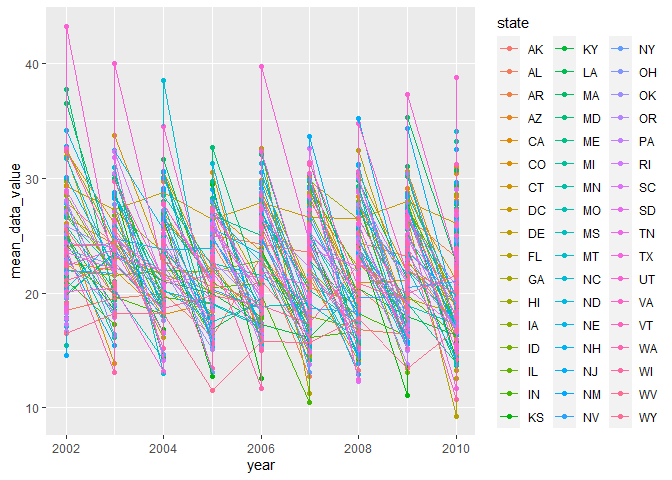
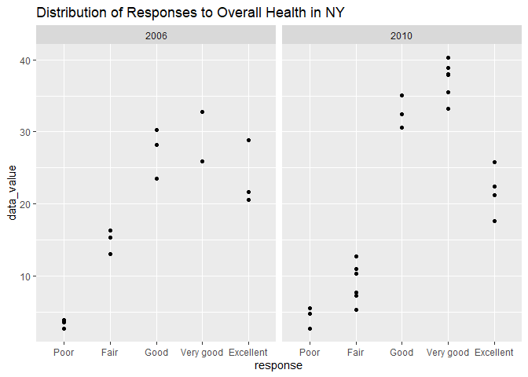
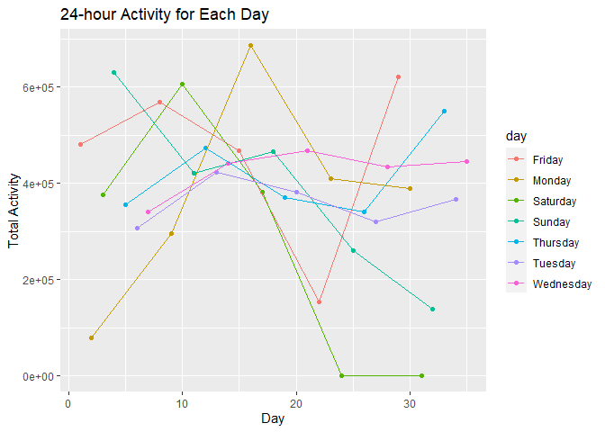

p8105\_hw3\_yo2336
================
Yoo Rim Oh

# Problem 1

Load instacart data

``` r
data("instacart")

range(pull(instacart, aisle_id))
```

    ## [1]   1 134

``` r
count(instacart, aisle_id, aisle)
```

    ## # A tibble: 134 x 3
    ##    aisle_id aisle                          n
    ##       <int> <chr>                      <int>
    ##  1        1 prepared soups salads       2936
    ##  2        2 specialty cheeses           3873
    ##  3        3 energy granola bars        17449
    ##  4        4 instant foods               9917
    ##  5        5 marinades meat preparation  2905
    ##  6        6 other                       1795
    ##  7        7 packaged meat               1526
    ##  8        8 bakery desserts             1501
    ##  9        9 pasta sauce                 9736
    ## 10       10 kitchen supplies             448
    ## # ... with 124 more rows

Aisle vs product plot

``` r
aisle_df =
  instacart %>%
  count(aisle_id) %>%
  filter(n > 10000) %>%
  rename(number_ordered = n) %>%
  ggplot(aes(x = aisle_id, y = number_ordered)) +
  geom_point() +
  scale_x_continuous(
    breaks = c(0, 25, 50, 75, 100, 125))
```

Popular items per aisle

``` r
bake_ingr_df =
  instacart %>%
  select(product_name, aisle) %>%
  filter(aisle == "baking ingredients") %>%
  count(aisle, product_name, name = "count_baking") %>%
  arrange(desc(count_baking)) %>%
  head(3) %>%
  mutate(rank = c(1, 2, 3)) %>%
  pivot_wider(
    names_from = "aisle",
    values_from = "product_name"
  ) %>%
  relocate(rank, "baking ingredients")

dog_food_care_df = 
  instacart %>%
  select(product_name, aisle) %>%
  filter(aisle == "dog food care") %>%
  count(aisle, product_name, name = "count_dog") %>%
  arrange(desc(count_dog)) %>%
  head(3) %>%
  mutate(rank = c(1, 2, 3)) %>%
  pivot_wider(
    names_from = "aisle",
    values_from = "product_name"
  ) %>%
  relocate(rank, "dog food care")

pack_veg_fruit_df = 
  instacart %>%
  select(product_name, aisle) %>%
  filter(aisle == "packaged vegetables fruits") %>%
  count(aisle, product_name, name = "count_packaged") %>%
  arrange(desc(count_packaged)) %>%
  head(3) %>%
  mutate(rank = c(1, 2, 3)) %>%
  pivot_wider(
    names_from = "aisle",
    values_from = "product_name"
  ) %>%
  relocate(rank, "packaged vegetables fruits")

popular_table_df = 
  left_join(bake_ingr_df, left_join(dog_food_care_df, pack_veg_fruit_df, by = "rank"), 
            by = "rank") %>%
  janitor::clean_names()

knitr::kable(popular_table_df, caption = "Top 3 Products Ordered from Selected Aisles")
```

| rank | baking\_ingredients | count\_baking | dog\_food\_care                               | count\_dog | packaged\_vegetables\_fruits | count\_packaged |
|-----:|:--------------------|--------------:|:----------------------------------------------|-----------:|:-----------------------------|----------------:|
|    1 | Light Brown Sugar   |           499 | Snack Sticks Chicken & Rice Recipe Dog Treats |         30 | Organic Baby Spinach         |            9784 |
|    2 | Pure Baking Soda    |           387 | Organix Chicken & Brown Rice Recipe           |         28 | Organic Raspberries          |            5546 |
|    3 | Cane Sugar          |           336 | Small Dog Biscuits                            |         26 | Organic Blueberries          |            4966 |

Top 3 Products Ordered from Selected Aisles

Mean hour per each day

``` r
pink_lady_apple =
  instacart %>%
  select("day" = "order_dow", order_hour_of_day, product_name) %>%
  filter(product_name == "Pink Lady Apples") %>%
  group_by(day) %>%
  summarize(mean_order_hour = mean(order_hour_of_day))
knitr::kable(pink_lady_apple, caption = "Mean Hour of Day Pink Lady Apples are Ordered")
```

| day | mean\_order\_hour |
|----:|------------------:|
|   0 |          13.44118 |
|   1 |          11.36000 |
|   2 |          11.70213 |
|   3 |          14.25000 |
|   4 |          11.55172 |
|   5 |          12.78431 |
|   6 |          11.93750 |

Mean Hour of Day Pink Lady Apples are Ordered

``` r
coffee_ice_cream =
  instacart %>%
  select("day" = "order_dow", order_hour_of_day, product_name) %>%
  filter(product_name == "Coffee Ice Cream") %>%
  group_by(day) %>%
  summarize(mean_order_hour = mean(order_hour_of_day))
knitr::kable(coffee_ice_cream, caption = "Mean Hour of Day Coffee Ice Creams are Ordered")
```

| day | mean\_order\_hour |
|----:|------------------:|
|   0 |          13.77419 |
|   1 |          14.31579 |
|   2 |          15.38095 |
|   3 |          15.31818 |
|   4 |          15.21739 |
|   5 |          12.26316 |
|   6 |          13.83333 |

Mean Hour of Day Coffee Ice Creams are Ordered

# Problem 2

Load BRFSS data

``` r
data(brfss_smart2010)
```

Clean BRFSS

``` r
overall_health =
  brfss_smart2010 %>%
  janitor::clean_names() %>%
  filter(topic == "Overall Health") %>%
  mutate(response = factor(response, levels = c("Poor", "Fair", "Good", "Very good", "Excellent"),
                           ordered = TRUE)) %>%
  rename("state" = "locationabbr", "county" = "locationdesc")
```

States with &gt;= 7 observed locations in 2002 and 2010

``` r
nrow(
overall_health %>%
  filter(year == 2002) %>%
  count(state) %>%
  mutate(n = n/5) %>%
  filter(n >= 7))
```

    ## [1] 6

``` r
nrow(
  overall_health %>%
  filter(year == 2010) %>%
  count(state) %>%
  mutate(n = n/5) %>%
  filter(n >= 7))
```

    ## [1] 14

Excellent response data frame and plot

``` r
excellent_df =
  overall_health %>%
  filter(response == "Excellent") %>%
  group_by(year, state, data_value) %>%
  summarize(mean_data_value = mean(data_value)) %>%
  select(-data_value)
```

    ## `summarise()` has grouped output by 'year', 'state'. You can override using the `.groups` argument.

``` r
excellent_df %>%
  ggplot(aes(x = year, y = mean_data_value, color = state)) +
  geom_point() +
  geom_line()
```

    ## Warning: Removed 4 rows containing missing values (geom_point).

    ## Warning: Removed 2 row(s) containing missing values (geom_path).

<!-- -->

Plot for NY responses to overall health in 2006 and 2010

``` r
overall_health %>%
  filter(state == "NY", year == c(2006, 2010)) %>%
  select(year, state, response, data_value) %>%
  ggplot(aes(x = response, y = data_value)) +
  geom_point() +
  facet_grid(. ~ year) +
  labs(title = "Distribution of Responses to Overall Health in NY")
```

    ## Warning in year == c(2006, 2010): longer object length is not a multiple of
    ## shorter object length

<!-- -->

# Problem 3

Load and clean data

``` r
accel_df = 
  read_csv("accel_data.csv") %>%
  janitor::clean_names() %>%
  mutate(week_type = case_when(
    day %in% c("Monday", "Tuesday", "Wednesday", "Thursday", "Friday") ~ "weekday",
    day %in% c("Saturday", "Sunday") ~ "weekend")) %>%
  relocate(week, day_id, day, week_type)
```

    ## Rows: 35 Columns: 1443

    ## -- Column specification --------------------------------------------------------
    ## Delimiter: ","
    ## chr    (1): day
    ## dbl (1442): week, day_id, activity.1, activity.2, activity.3, activity.4, ac...

    ## 
    ## i Use `spec()` to retrieve the full column specification for this data.
    ## i Specify the column types or set `show_col_types = FALSE` to quiet this message.

total activity for each day

``` r
total_activity_df = 
  accel_df %>%
  group_by(week, day) %>%
  summarize(total_activity = sum(across(starts_with("activity"))))
```

    ## `summarise()` has grouped output by 'week'. You can override using the `.groups` argument.

``` r
knitr::kable(total_activity_df, caption = "Total Activity for Each Day")
```

| week | day       | total\_activity |
|-----:|:----------|----------------:|
|    1 | Friday    |       480542.62 |
|    1 | Monday    |        78828.07 |
|    1 | Saturday  |       376254.00 |
|    1 | Sunday    |       631105.00 |
|    1 | Thursday  |       355923.64 |
|    1 | Tuesday   |       307094.24 |
|    1 | Wednesday |       340115.01 |
|    2 | Friday    |       568839.00 |
|    2 | Monday    |       295431.00 |
|    2 | Saturday  |       607175.00 |
|    2 | Sunday    |       422018.00 |
|    2 | Thursday  |       474048.00 |
|    2 | Tuesday   |       423245.00 |
|    2 | Wednesday |       440962.00 |
|    3 | Friday    |       467420.00 |
|    3 | Monday    |       685910.00 |
|    3 | Saturday  |       382928.00 |
|    3 | Sunday    |       467052.00 |
|    3 | Thursday  |       371230.00 |
|    3 | Tuesday   |       381507.00 |
|    3 | Wednesday |       468869.00 |
|    4 | Friday    |       154049.00 |
|    4 | Monday    |       409450.00 |
|    4 | Saturday  |         1440.00 |
|    4 | Sunday    |       260617.00 |
|    4 | Thursday  |       340291.00 |
|    4 | Tuesday   |       319568.00 |
|    4 | Wednesday |       434460.00 |
|    5 | Friday    |       620860.00 |
|    5 | Monday    |       389080.00 |
|    5 | Saturday  |         1440.00 |
|    5 | Sunday    |       138421.00 |
|    5 | Thursday  |       549658.00 |
|    5 | Tuesday   |       367824.00 |
|    5 | Wednesday |       445366.00 |

Total Activity for Each Day

Plot of activity over 24 hour each day

``` r
accel_df %>%
  group_by(day_id, day) %>%
  summarize(total_activity = sum(across(starts_with("activity")))) %>%
  ggplot(aes(x = day_id, y = total_activity, color = day)) +
  geom_point() +
  geom_line() +
  labs(title = "24-hour Activity for Each Day",
       x = "Day",
       y = "Total Activity")
```

    ## `summarise()` has grouped output by 'day_id'. You can override using the `.groups` argument.

<!-- -->
